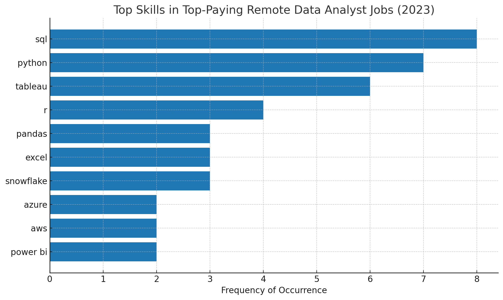

# SQL Insights: 2023 Remote Data Analyst Job Market

## Table of Contents
1. [Introduction](#introduction)
2. [Background](#background)
3. [Key Questions](#key-questions)
4. [Tools I Used](#tools-i-used)
5. [The Analysis](#the-analysis)
6. [What I Learned](#what-i-learned)
7. [Conclusions](#conclusions)

## Introduction 
The data job market is evolving fast. This project dives into 2023’s remote Data Analyst job landscape to uncover which skills pay the most, which are most in demand, and where salary and demand intersect — giving job seekers a competitive edge.

Want to see the SQL queries? Find them here: [project_SQL folder](/project_SQL/)

## Background
Motivated by the goal of navigating the data analyst job market more efficiently, this project aims to identify the highest-paying and most in-demand skills, helping others streamline their search for the best opportunities.

The dataset includes valuable insights on job titles, salaries, locations, and key skills.

## Key Questions
### The questions I wanted to answer through my SQL queries were:
1. What are the top-paying data analyst jobs?
2. What skills are required for these top-paying jobs?
3. What skills are most in-demand for data analysts?
4. Which skills are associated with higher salaries?
5. What are the most optimal skills to learn?

## Tools I Used
To explore the data analyst job market in depth, I relied on several essential tools:
- **SQL** – The backbone of the analysis, used to query the database and uncover key insights.
- **PostgreSQL** – The database management system chosen for handling the job posting data.
- **Visual Studio Code** – My preferred environment for managing the database and running SQL queries.
- **Git & GitHub** – Crucial for version control, sharing SQL scripts and analysis, and keeping the project organized.

## The Analysis
Each query in this project was designed to explore a specific aspect of the data analyst job market. Here’s how I approached each question:

### 1. Top-Paying Data Analyst Jobs
I examined data analyst listings to pinpoint roles offering the highest annual salaries, narrowing the search to remote positions. This analysis spotlights where the most rewarding opportunities are in the field.

<details>
<summary>Click to view SQL query</summary>

```sql
SELECT
    job_id,
    job_title,
    job_location,
    job_schedule_type,
    salary_year_avg,
    job_posted_date,
    name AS company_name
FROM
    job_postings_fact
LEFT JOIN company_dim ON job_postings_fact.company_id = company_dim.company_id
WHERE
    job_title_short = 'Data Analyst'
    AND job_location = 'Anywhere'
    AND salary_year_avg IS NOT NULL
ORDER BY
    salary_year_avg DESC
LIMIT
    10;
```
</details>

#### Key Insights – Top 10 Remote Data Analyst Average Salaries in 2023
1. **High earning potential** – Annual salaries range from about $184,000 to $650,000.
2. **Seniority matters** – Many of the highest-paying positions are senior or leadership roles, such as Director or Principal Data Analyst.
3. **Individual contributors can still excel** – A few top spots are held by non-management analyst positions.


*Bar chart of the Top 10 highest-paying remote Data Analyst roles in 2023, based on average salaries.*

### 2. Skills for Top-Paying Jobs
To identify the skills most valued in high-paying roles, I joined job postings with their associated skills data. This revealed which technical and analytical abilities are most commonly required for the highest-paying remote Data Analyst positions.

<details>
<summary>Click to view SQL query</summary>

```sql
WITH top_paying_jobs AS(
    SELECT
        job_id,
        job_title,
        salary_year_avg,
        name AS company_name
    FROM
        job_postings_fact
    LEFT JOIN company_dim ON job_postings_fact.company_id = company_dim.company_id
    WHERE
        job_title_short = 'Data Analyst'
        AND job_location = 'Anywhere'
        AND salary_year_avg IS NOT NULL
    ORDER BY
        salary_year_avg DESC
    LIMIT
        10
)

SELECT 
    top_paying_jobs.*,
    skills
FROM 
    top_paying_jobs
INNER JOIN skills_job_dim ON top_paying_jobs.job_id = skills_job_dim.job_id
INNER JOIN skills_dim ON skills_job_dim.skill_id = skills_dim.skill_id
ORDER BY
    salary_year_avg DESC;
```
</details>

#### Key Insights – Skills for Top-Paying Remote Data Analyst Roles in 2023
- **SQL and Python are essential** – These two form the core technical foundation for high-paying analyst positions.
- **BI tools are highly valued** – Skills in tools like Tableau, Power BI, Excel, and Pandas are consistently sought after.
- **Cloud and data platforms are rising in importance** – Platforms like Snowflake, Databricks, and Azure are frequently listed, signaling growing demand for cloud-based data expertise.



*Bar chart of the frequency of skills in the highest-paying remote Data Analyst roles in 2023.*
 
### 3. In-Demand Skills for Data Analysts
This analysis highlights the skills most frequently mentioned across all data analyst job postings, helping to pinpoint which tools and technologies are in highest demand across the market.

<details>
<summary>Click to view SQL query</summary>

```sql
SELECT
    skills,
    COUNT(skills_job_dim.job_id) AS demand_count
FROM 
    job_postings_fact
INNER JOIN skills_job_dim ON job_postings_fact.job_id = skills_job_dim.job_id
INNER JOIN skills_dim ON skills_job_dim.skill_id = skills_dim.skill_id
WHERE
    job_title_short = 'Data Analyst'
    AND job_work_from_home = TRUE
GROUP BY
    skills
ORDER BY
    demand_count DESC
LIMIT 5;
```
</details>

#### Key Insights – Most In-Demand Skills for Remote Data Analyst Roles in 2023
- **SQL leads the market** – With over 7,000 job postings, SQL stands out as the most in-demand skill, reinforcing its role as the foundation of data work.
- **Excel and Python are essentials** – Both are widely required for tasks like analysis, automation, and data manipulation.
- **Data visualization is a must-have** – Tools like Tableau and Power BI are in high demand, reflecting the importance of turning data into clear insights.

| Rank | Skill     | Job Postings |
|------|-----------|--------------|
| 1    | SQL       | 7,291        |
| 2    | Excel     | 4,611        |
| 3    | Python    | 4,330        |
| 4    | Tableau   | 3,745        |
| 5    | Power BI  | 2,609        |

*Table of the Top 5 most in-demand skills for remote Data Analyst roles in 2023.*

### 4. Skills Based on Salary
This analysis compares average salaries across different skills to identify which ones are linked to the highest-paying Data Analyst roles.

<details>
<summary>Click to view SQL query</summary>

```sql
SELECT
    skills,
    ROUND(AVG(salary_year_avg), 0) AS avg_salary
FROM 
    job_postings_fact
INNER JOIN skills_job_dim ON job_postings_fact.job_id = skills_job_dim.job_id
INNER JOIN skills_dim ON skills_job_dim.skill_id = skills_dim.skill_id
WHERE
    job_title_short = 'Data Analyst'
    AND salary_year_avg IS NOT NULL
    AND job_work_from_home = TRUE
GROUP BY
    skills
ORDER BY
    avg_salary DESC
LIMIT 25;
```
</details>

#### Key Insights – Highest-Paying Skills for Remote Data Analyst Roles in 2023
- **Big Data & ML drive top salaries** – Skills like PySpark, Couchbase, and DataRobot command high pay, reflecting demand for large-scale data processing and predictive modeling.
- **DevOps crossover adds value** – Tools such as GitLab, Kubernetes, and Airflow highlight the earning potential of automation and pipeline management expertise.
- **Cloud skills boost earnings** – Knowledge of platforms like Elasticsearch, Databricks, and GCP aligns with the industry’s shift toward cloud-based analytics.

| skills | avg_salary |
| :--- | :--- |
| PySpark | $208,172 |
| Bitbucket | $189,155 |
| Couchbase | $160,515 |
| Watson | $160,515 |
| DataRobot | $155,486 |
| GitLab | $154,500 |
| Swift | $153,750 |
| Jupyter | $152,777 |
| Pandas | $151,821 |
| Elasticsearch | $145,000 |

*Table of the Top 10 highest-paying skills for remote Data Analyst roles in 2023.*

### 5. Most Optimal Skills to Learn
By combining demand and salary data, this analysis identifies skills that are both highly sought after and well-paid, providing a strategic guide for prioritizing skill development.

<details>
<summary>Click to view SQL query</summary>

```sql
SELECT
    skills_dim.skill_id,
    skills_dim.skills,
    COUNT(skills_job_dim.job_id) AS demand_count,
    ROUND(AVG(job_postings_fact.salary_year_avg), 0) AS avg_salary
FROM 
    job_postings_fact
INNER JOIN skills_job_dim ON job_postings_fact.job_id = skills_job_dim.job_id
INNER JOIN skills_dim ON skills_job_dim.skill_id = skills_dim.skill_id
WHERE
    job_postings_fact.job_title_short = 'Data Analyst'
    AND job_postings_fact.salary_year_avg IS NOT NULL
    AND job_postings_fact.job_work_from_home = TRUE
GROUP BY
    skills_dim.skill_id, skills_dim.skills
HAVING
    COUNT(skills_job_dim.job_id) > 10
ORDER BY
    demand_count DESC,
    avg_salary DESC    
LIMIT 25;
```
</details> 

| Rank | Skill       | Demand Count | Avg. Salary (USD) |
|------|-------------|--------------|-------------------|
| 1    | SQL         | 398          | $97,237           |
| 2    | Excel       | 256          | $87,288           |
| 3    | Python      | 236          | $101,397          |
| 4    | Tableau     | 230          | $99,288           |
| 5    | R           | 148          | $100,499          |
| 6    | Power BI    | 110          | $97,431           |
| 7    | SAS         | 63           | $98,902           |
| 8    | PowerPoint  | 58           | $88,701           |
| 9    | Looker      | 49           | $103,795          |
| 10   | Word        | 48           | $82,576           |
| 11   | Snowflake   | 37           | $112,948          |
| 12   | Oracle      | 37           | $104,534          |
| 13   | SQL Server  | 35           | $97,786           |
| 14   | Azure       | 34           | $111,225          |
| 15   | AWS         | 32           | $108,317          |

*Table of the Top 15 most optimal skills for remote Data Analyst roles in 2023, ranked by demand count and average salary.*

#### Key Insights – Most Optimal Skills for Remote Data Analyst Roles in 2023
- **Core skills dominate demand** – SQL ($97,237), Excel ($87,288), and Python ($101,397) lead by a large margin, forming the technical backbone for most analyst roles and appearing in hundreds of job postings.
- **BI and visualization tools are essential** – Tableau ($99,288), Power BI ($97,431), and Looker ($103,795) combine strong demand with competitive salaries, underscoring the importance of effectively presenting data-driven insights.
- **Cloud and database expertise boosts pay** – Skills like Snowflake ($112,948), Azure ($111,225), AWS ($108,317), and Oracle ($104,534) consistently command above-average salaries, reflecting the industry’s move toward cloud-based analytics solutions.
- **Specialized programming & big data tools add value** – Go ($115,320), Hadoop ($113,193), and JavaScript ($97,587), while less common, offer strong earning potential when paired with core data skills, making them strategic additions for career growth.

## What I Learned
This project significantly expanded my SQL expertise and sharpened my analytical mindset, but also challenged me to think like a hiring manager looking for data-driven insights.
- **Advanced query building** – Gained proficiency in crafting complex SQL queries, joining multiple tables, and using CTEs (`WITH` clauses) for cleaner, more modular code.
- **Data aggregation & summarization** – Became adept at using `GROUP BY`, `COUNT()`, `AVG()`, and other aggregate functions to distill large datasets into actionable findings.
- **Problem-solving under constraints** – Faced challenges with incomplete or inconsistent job posting data; solved this by adding filters, handling NULL values, and testing multiple query approaches.
- **Storytelling with data** – Learned to structure my analysis so that queries, visualizations, and insights naturally flow into a narrative that answers real-world career questions.
- **Transferable skills** – Strengthened skills directly relevant to BI reporting, ETL pipeline design, and business decision-making — making the findings applicable beyond just job market analysis.
- **Version control discipline** – Improved my use of Git & GitHub for tracking changes, organizing queries, and collaborating in a reproducible way.


## Conclusions
### Insights from the Analysis
- **Top-paying remote roles** – Salaries range widely, with the highest reaching $650,000, showing the strong earning potential for experienced data analysts.
- **Skills for top-paying jobs** – Advanced proficiency in SQL is a recurring requirement, making it a critical skill for securing high-compensation positions.
- **Most in-demand skills** – SQL also tops the list in-demand, cementing its status as essential for job seekers.
- **Skills linked to higher salaries** – Niche and specialized skills, such as SVN and Solidity, are associated with some of the highest average salaries, indicating a premium for rare expertise.
- **Optimal skills for market value** – SQL combines high demand with a competitive average salary, making it one of the most strategic skills to learn for maximizing career opportunities.

### Closing Thoughts
This project not only strengthened my SQL expertise but also provided actionable insights into the remote data analyst job market. The findings offer a roadmap for prioritizing skills that balance high demand with strong earning potential. For aspiring and current data analysts, focusing on these skills can improve marketability and open doors to top-tier opportunities. Continuous learning and adaptability to evolving tools and platforms remain key to long-term success in the field.